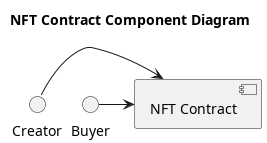
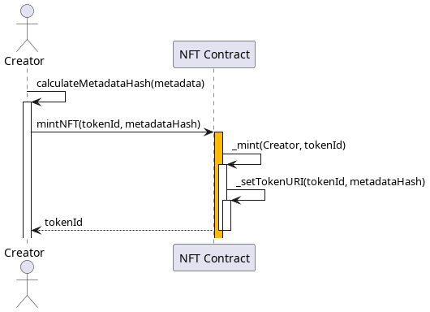
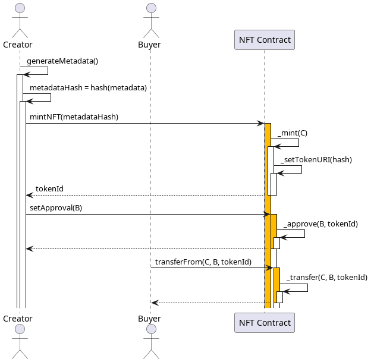

# Setup

## Open with Gitpod

# NFT Contract UML Diagrams

This README provides a detailed explanation of the UML diagrams for the NFT Contract. The diagrams are located in the `out/diagrams` directory.

## Component Diagram

The component diagram provides a high-level overview of the system. It shows the main components and their interactions.

In this diagram, we have two interfaces: `Creator` and `Buyer`. Both interact with the `NFT Contract` component.

## Mint Sequence Diagram

The mint sequence diagram describes the process of minting a new NFT.

The sequence starts with the `Creator` calculating the metadata hash. The `Creator` then calls the `mintNFT` function on the `NFT Contract`, passing the `tokenId` and `metadataHash`. The `NFT Contract` then mints the new token and sets the token URI, before returning the `tokenId` to the `Creator`.

## NFT Sequence Diagram

The NFT sequence diagram describes the full lifecycle of an NFT, from creation to transfer.

The sequence starts with the `Creator` generating the metadata and calculating the metadata hash. The `Creator` then mints the NFT and sets approval for the `Buyer`. The `Buyer` can then call `transferFrom` to transfer the NFT from the `Creator` to themselves.

